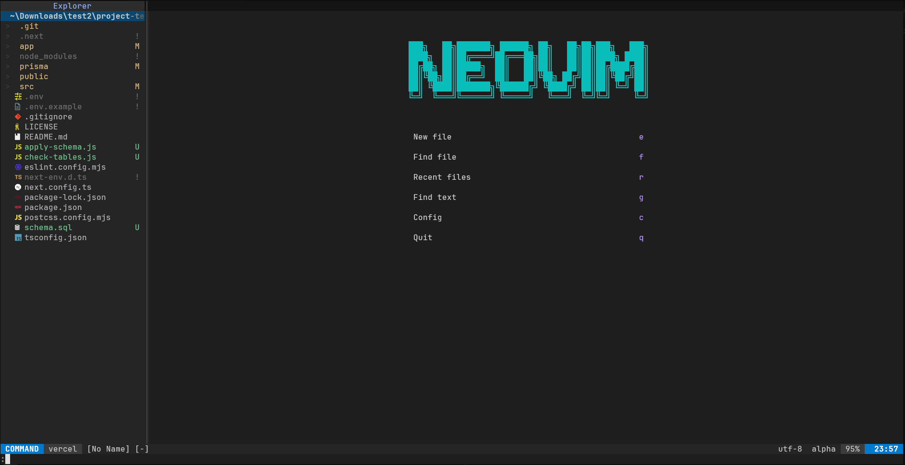

# Minimal Neovim Config (Lazy.nvim)

🌐 [EN](README.md) | [TH](README_th.md) | [JP](README_jp.md) | [CN](README_cn.md) | [KR](README_kr.md)



一个功能强大的 **单文件 Neovim 配置**，使用 `lazy.nvim`，外观和操作感类似 VSCode。

## Features

- 插件管理器：lazy.nvim（自动引导）
- VSCode 风格暗色主题（Carbonfox / Nightfox）
- 文件浏览器：Neo-tree（自动打开，支持右键操作菜单）
- Telescope（模糊查找 — Ctrl+P，命令面板）
- LSP + 自动补全（Mason、nvim-cmp、LuaSnip）— IntelliSense 体验
- Treesitter 语法高亮
- Git 标记与行内 blame
- 状态栏（lualine）和标签栏（bufferline）— VSCode 风格
- 集成终端（toggleterm — Ctrl+\`）
- 行内诊断（error-lens + lsp_lines）
- 缩进线、自动括号、which-key 弹窗
- Discord Rich Presence
- 启动界面（alpha-nvim）
- 按 F5 / `<Space>r` 运行当前文件
- Nerd Font 图标

---

## Requirements

- Neovim >= 0.9
- Git
- Nerd Font（图标必需）
- Node.js（用于 ts_ls、html、css、json LSP）
- Python（用于 pyright LSP）
- Rust / cargo（用于 rust_analyzer LSP）

---

## Installation

克隆该配置：

```bash
git clone https://github.com/DragoonT/init-termux-neovim.git init
```

## Quick Install (Single File)

你可以只使用 `init.lua` 文件来安装此配置（无需克隆整个仓库）。

```bash
mkdir -p ~/.config/nvim
[ -f ~/.config/nvim/init.lua ] && cp ~/.config/nvim/init.lua ~/.config/nvim/init.lua.bak
curl -o ~/.config/nvim/init.lua https://raw.githubusercontent.com/DragoonT/init-termux-neovim/main/init.lua
```

启动 Neovim：

```bash
nvim
```

首次启动时会自动安装插件。

---

## Recommended: Use tmux

建议在 `tmux` 中运行 Neovim，以避免 Termux 的 UI 问题（例如侧边栏消失）。

```bash
pkg install tmux
tmux
nvim
```

---

## Nerd Font (Required for Icons)

此配置使用图标，因此需要 **Nerd Font**，否则图标会显示为方块或乱码。

### Termux 安装

```bash
mkdir -p ~/.termux
curl -L -o ~/.termux/font.ttf \
https://github.com/ryanoasis/nerd-fonts/raw/master/patched-fonts/FiraCode/Regular/FiraCodeNerdFont-Regular.ttf
termux-reload-settings
```

### 推荐字体

- FiraCode Nerd Font
- JetBrainsMono Nerd Font
- Hack Nerd Font

---

## Theme

此配置使用 **Carbonfox**（来自 Nightfox），是一个与 VSCode 配色一致的暗色主题。

运行时切换主题：

```vim
:colorscheme carbonfox
:colorscheme nightfox
:Telescope colorscheme
```

---

## File Explorer（Neo-tree）

- 启动时自动打开（左侧栏，宽度 30）
- 在文件/文件夹上按 `<Space>` 打开操作菜单：
  - 新建文件 / 新建文件夹
  - 重命名
  - 复制 / 剪切 / 粘贴
  - 删除（需确认）
  - 复制路径

| 快捷键 | 功能 |
|--------|------|
| `<leader>e` / `<C-b>` | 切换 Neo-tree |
| `<Space>`（在树中） | 打开操作菜单 |

---

## LSP & 自动补全

由 **Mason** 管理，以下语言服务器自动安装：

| 语言 | 服务器 |
|------|--------|
| Lua | lua_ls |
| JavaScript / TypeScript | ts_ls |
| Python | pyright |
| CSS | cssls |
| HTML | html |
| JSON | jsonls |
| Rust | rust_analyzer |

### LSP 快捷键

| 快捷键 | 功能 |
|--------|------|
| `gd` | 跳转到定义 |
| `gD` | 跳转到声明 |
| `gr` | 查看引用 |
| `gi` | 跳转到实现 |
| `K` | 悬停文档 |
| `<leader>rn` | 重命名符号 |
| `<leader>ca` | 代码操作 |
| `<leader>f` | 格式化文件 |
| `[d` / `]d` | 上/下一个诊断 |
| `<leader>e` | 显示诊断浮窗 |

### 自动补全

| 快捷键 | 功能 |
|--------|------|
| `<Tab>` | 下一项 / 展开代码片段 |
| `<S-Tab>` | 上一项 |
| `<CR>` | 确认选择 |
| `<C-Space>` | 触发补全 |
| `<C-e>` | 取消 |

---

## Telescope（模糊查找）

| 快捷键 | 功能 |
|--------|------|
| `<C-p>` | 查找文件 |
| `<C-S-p>` | 命令面板 |
| `<leader>fg` | 全局文本搜索 |
| `<leader>fb` | 缓冲区列表 |
| `<leader>fd` | 诊断信息 |
| `<leader>fr` | 最近文件 |
| `<leader>ff` | 在项目中查找文本 |
| `<leader>fa` | 查找主目录所有文件 |
| `<leader>fs` | 从当前文件所在目录查找 |
| `<leader>th` | 浏览配色方案 |
| `<leader>vc` | 在 nvim 配置中查找 |

---

## 运行代码（F5 / `<Space>r`）

按 `<F5>`、`<C-F5>` 或 `<leader>r` 在终端分割中运行**当前文件**。

支持的文件类型：

| 文件类型 | 运行方式 |
|----------|----------|
| Python | `python file.py` |
| JavaScript | `node file.js` |
| TypeScript / TSX | `npx ts-node file.ts` |
| Lua | `lua file.lua` |
| Bash / sh | `bash file.sh` |
| PowerShell | `powershell -File file.ps1` |
| Rust | `cargo run` |
| Go | `go run file.go` |
| C | `gcc` → 运行输出 |
| C++ | `g++` → 运行输出 |
| Java | `javac` → `java` |
| PHP | `php file.php` |
| Ruby | `ruby file.rb` |

---

## 终端（Toggleterm）

| 快捷键 | 功能 |
|--------|------|
| `<C-\`>` | 切换终端 |
| `<leader>t1/t2/t3` | 打开终端 1/2/3 |
| `<Esc>`（终端中） | 退出到普通模式 |

---

## 导航与编辑

### 保存 / 退出

| 快捷键 | 功能 |
|--------|------|
| `<C-s>` | 保存 |
| `<leader>q` / `<C-q>` | 退出全部 |
| `<leader>wq` | 保存全部并退出 |

### 撤销 / 重做

| 快捷键 | 功能 |
|--------|------|
| `<C-z>` | 撤销 |
| `<C-y>` | 重做 |

### 复制 / 粘贴 / 删除

| 快捷键 | 功能 |
|--------|------|
| `y` | 复制（保持选区） |
| `<C-c>`（可视模式） | 复制到系统剪贴板 |
| `<C-v>` | 从系统剪贴板粘贴 |
| `<leader>d` | 删除（不影响剪贴板） |
| `d` | 剪切（删除并保存到寄存器） |

### 其他

| 快捷键 | 功能 |
|--------|------|
| `<C-a>` / `<leader>a` | 全选 |
| `<C-w>` | 关闭缓冲区 |
| `<A-Up>` / `<A-Down>` | 上/下移动行 |
| `<A-S-Down>` | 复制行 |
| `<C-/>` | 切换注释 |
| `<Tab>` / `<S-Tab>`（可视） | 增加/减少缩进 |
| `<C-h/j/k/l>` | 导航分割窗口 |
| `<C-Tab>` / `<C-S-Tab>` | 下/上一个缓冲区标签 |
| `<Esc>` | 清除搜索高亮 |

---

## Git（Gitsigns）

- 槽口标记显示新增 / 修改 / 删除行
- 当前行内联 git blame（延迟 500ms）
- 格式：`作者，YYYY-MM-DD - 提交信息`

---

## 插件管理

```vim
:Lazy update   " 更新插件
:Lazy clean    " 删除未使用的插件
:Lazy sync     " 安装缺失的插件
```

---

## Reset

```bash
rm -rf ~/.local/share/nvim
```

---

## Windows 支持

在 Windows 上，配置会自动：
- 将 PowerShell 设为 shell
- 使用 `win32yank.exe` 进行剪贴板集成
