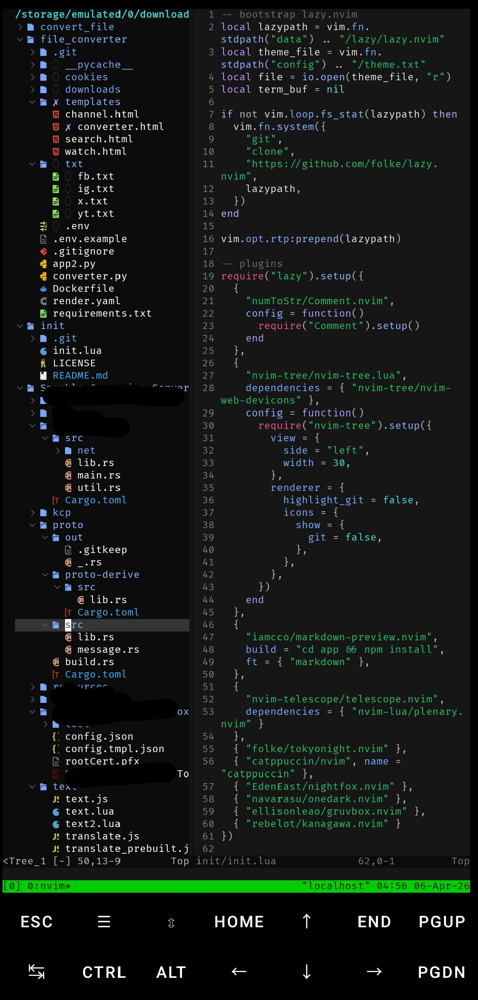
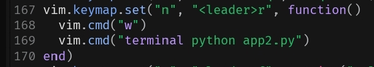

# Minimal Neovim Config (Lazy.nvim)



A simple **single-file Neovim configuration** using `lazy.nvim`.

## Features

- Plugin manager: lazy.nvim (auto bootstrap)
- File explorer (nvim-tree, auto opens)
- Telescope (fuzzy finder)
- Multiple themes with persistence
- Comment support
- Nerd Font icons

## File Explorer

- Uses nvim-tree
- Opens automatically on startup
- Shows files and folders on the left

---

## Requirements

- Neovim >= 0.9  
- Git  
- Nerd Font (required for icons)

---

## Installation

Clone this config:

```bash
git clone https://github.com/DragoonT/init-termux-neovim.git init
```

## Quick Install (Single File)

You can install this config using only the "init.lua" file (no need to clone the full repo).

### Install

```bash
mkdir -p ~/.config/nvim
```
```bash
# Backup if config already exists
[ -f ~/.config/nvim/init.lua ] && cp ~/.config/nvim/init.lua ~/.config/nvim/init.lua.bak
```
```bash
# Download init.lua
curl -o ~/.config/nvim/init.lua https://raw.githubusercontent.com/DragoonT/init-termux-neovim/main/init.lua
```

Start Neovim

```bash
nvim
```

Plugins will install automatically on first launch.

---

## Recommended: Use tmux

Run Neovim inside `tmux` to avoid UI issues in Termux (e.g. sidebar disappearing).

---

### Install (Termux)

```bash
pkg install tmux
```

### Usage
```bash
tmux
```

Then run Neovim:
```bash
nvim
```

---

## Nerd Font (Required for Icons)

This config uses icons (file tree, UI, etc.), so you need a **Nerd Font**.

Without it, icons will look like squares or broken symbols.

### Termux Installation

```bash
mkdir -p ~/.termux
```
```bash
curl -L -o ~/.termux/font.ttf \
https://github.com/ryanoasis/nerd-fonts/raw/master/patched-fonts/FiraCode/Regular/FiraCodeNerdFont-Regular.ttf
```
```bash
termux-reload-settings
```

### Recommended Fonts

- FiraCode Nerd Font
- JetBrainsMono Nerd Font
- Hack Nerd Font

### Notes

- Termux ONLY uses: `~/.termux/font.ttf`
- You must reload settings after installing
- Required for:
  - nvim-tree
  - nvim-web-devicons

---

## Themes

- tokyonight  
- catppuccin  
- nightfox  
- onedark  
- gruvbox  
- kanagawa  

Change theme:

```vim
:colorscheme tokyonight
```

---

## OneDark styles

Special command for OneDark:

```vim
:OneDark dark
:OneDark darker
:OneDark cool
:OneDark deep
:OneDark warm
:OneDark warmer
```

Selected style is saved automatically and restored on restart.

---

## Fuzzy Finder

- Telescope installed and ready

Example:

```vim
:Telescope find_files
```

- Change themes

```vim
:Telescope colorscheme
```

---

## How it works

- `lazy.nvim` bootstraps automatically (no manual install needed)
- Theme is saved in:

```bash
~/.config/nvim/theme.txt
```

- Config is fully contained in one `init.lua` file

---

# Which-Key Support

## Keybindings

> Leader key = `Space`

---

### Find Files
- `<Space>f` → Find files  
- `<Space>ff` → Find files in project (Telescope)

---

## Navigation & Editing

### Improved Copy Behavior

- `y` → Copy without losing selection

> Keeps visual selection after yank for faster editing

---

## Delete vs Cut (Custom Behavior)

By default, Neovim treats **delete as cut**:
- `d` → deletes text **and saves it to clipboard/register**
- You can paste it later with `p`

### Custom Delete (No Clipboard)

This config adds a true **delete** behavior (like VSCode):

- `<Space>d` → delete text **without saving**
- `d` → still works as cut (default behavior)

### Configuration

```lua
-- Delete without affecting clipboard
vim.keymap.set("n", "<leader>d", '"_d')
vim.keymap.set("v", "<leader>d", '"_d')
```

### Summary

| Key | Action |
|-----|--------|
| `d` | Cut (delete + save) |
| `<Space>d` | Delete (no save) |
| `p` | Paste |

> This helps prevent overwriting your clipboard when deleting text.

---

### Indentation (Improved)

- `<` → Shift left  
- `>` → Shift right  

> Indents by **1 space** instead of default (2–4 spaces)  
> Keeps selection after indent (no need to reselect)

---

### Comment
- `gcc` → Toggle comment (line)  
- `gc` → Toggle comment (visual selection)

---

### Telescope
- `<Space>f` → Find files  
- `:Telescope find_files` → Manual command  

---

## Run Code

Press `<Space>r` to execute the project entry file (`app2.py`) in a terminal

> Note: This does not run the current file — it always runs `app2.py`



## Optional: Run Current File (Fallback to app2.py)

If you want `<Space>r` to run the current file instead, you can replace the keybinding with this:

```lua
vim.keymap.set("n", "<leader>r", function()
  vim.cmd("w")

  local app = "app2.py"
  if vim.fn.filereadable(app) == 1 then
    vim.cmd("terminal python " .. app)
  else
    vim.cmd("terminal python %")
  end
end)
```

---

### Notes
- Uses `Space` as leader key  
- Designed for speed and simplicity

---

## Plugin Management

```vim
:Lazy update  " update plugins
:Lazy clean   " remove unused plugins
:Lazy sync    " install missing plugins
```

---

## Reset

```bash
rm -rf ~/.local/share/nvim
```
